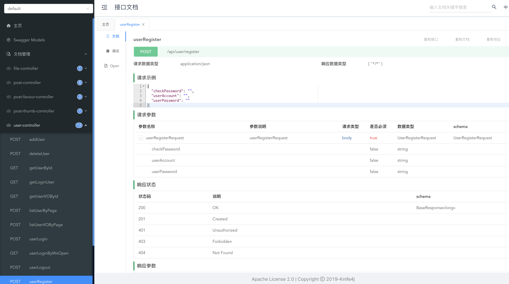

# Prep Quest AI - Backend

A comprehensive Spring Boot backend API for an AI-powered interview and exam preparation platform. This system manages question banks, questions, user authentication, and community features with built-in integrations for search, storage, and social platforms.

## 📋 Table of Contents

- [Features](#-features)
- [Tech Stack](#-tech-stack)
- [Architecture](#-architecture)
- [Getting Started](#-getting-started)
- [Configuration](#-configuration)
- [API Documentation](#-api-documentation)
- [Database Schema](#-database-schema)
- [Project Structure](#-project-structure)

## ✨ Features

### Core Functionality
- **Question Bank Management**: Create, organize, and manage collections of interview/exam questions
- **Question Management**: CRUD operations for questions with tags, answers, and rich content
- **Question-Bank Association**: Flexible many-to-many relationships between questions and banks
- **User System**: Complete user authentication, authorization, and profile management
- **Community Features**: Posts with likes and favorites for user engagement
- **File Management**: Upload and manage files with Tencent COS integration

### Technical Features
- **Role-Based Access Control**: User/Admin/Banned roles with custom annotation-based auth
- **Distributed Session**: Redis-based session management (optional)
- **Full-Text Search**: Elasticsearch integration for advanced search capabilities (optional)
- **WeChat Integration**: Support for WeChat MP and Open Platform login
- **API Documentation**: Interactive Swagger/Knife4j documentation
- **Scheduled Jobs**: Background tasks for data synchronization
- **Excel Import/Export**: Easy Excel integration for bulk operations
- **Global Error Handling**: Unified exception handling and response formatting
- **Request Logging**: AOP-based logging for all requests
- **CORS Support**: Pre-configured cross-origin resource sharing

## 🛠 Tech Stack

### Framework & Core
- **Spring Boot** 2.7.2 - Core framework
- **Spring MVC** - Web layer
- **Spring AOP** - Cross-cutting concerns
- **Spring Scheduler** - Scheduled tasks
- **MyBatis** + **MyBatis Plus** 3.5.2 - ORM with pagination

### Data Storage
- **MySQL** - Primary database
- **Redis** - Distributed session and caching (optional)
- **Elasticsearch** - Full-text search engine (optional)
- **Tencent COS** - Cloud object storage

### Third-Party Integrations
- **WeChat SDK** 4.4.0 - WeChat MP and Open Platform
- **Knife4j** 4.4.0 - Enhanced Swagger API documentation

### Utilities
- **Hutool** 5.8.8 - Java utility library
- **Apache Commons Lang3** - Common utilities
- **Easy Excel** 3.1.1 - Excel processing
- **Lombok** - Boilerplate code reduction

## 🏗 Architecture

```
┌─────────────────────────────────────────────────┐
│              Controller Layer                    │
│  (REST APIs, Request Validation, Auth Check)    │
└─────────────────────────────────────────────────┘
                       ↓
┌─────────────────────────────────────────────────┐
│               Service Layer                      │
│    (Business Logic, Transaction Management)     │
└─────────────────────────────────────────────────┘
                       ↓
┌─────────────────────────────────────────────────┐
│            Mapper/DAO Layer                      │
│    (MyBatis Plus, Database Operations)          │
└─────────────────────────────────────────────────┘
                       ↓
┌─────────────────────────────────────────────────┐
│              Data Sources                        │
│    (MySQL, Redis, Elasticsearch, COS)           │
└─────────────────────────────────────────────────┘
```

**Cross-Cutting Concerns (AOP)**:
- Authentication & Authorization (`@AuthCheck`)
- Request/Response Logging
- Exception Handling

## 🚀 Getting Started

### Prerequisites
- **JDK** 1.8 or higher
- **Maven** 3.6+
- **MySQL** 5.7+ or 8.0+
- **Redis** (optional, for distributed session)
- **Elasticsearch** 7.x+ (optional, for search)

### Installation

1. **Clone the repository**
   ```bash
   git clone <repository-url>
   cd prep-quest-ai-backend
   ```

2. **Configure database**
   - Create database:
     ```bash
     mysql -u root -p < sql/create_table.sql
     ```
   - Update `src/main/resources/application.yml` with your MySQL credentials

3. **Build the project**
   ```bash
   ./mvnw clean install
   ```
   Or on Windows:
   ```cmd
   mvnw.cmd clean install
   ```

4. **Run the application**
   ```bash
   ./mvnw spring-boot:run
   ```
   The application will start on `http://localhost:8101/api`

## ⚙ Configuration

### Basic Configuration (Required)

#### 1. MySQL Database
Edit `src/main/resources/application.yml`:
```yaml
spring:
  datasource:
    driver-class-name: com.mysql.cj.jdbc.Driver
    url: jdbc:mysql://localhost:3306/prepquestai_db
    username: root
    password: your_password
```

### Optional Features

#### 2. Enable Redis (Distributed Session)

**Step 1**: Update `application.yml`:
```yaml
spring:
  redis:
    database: 1
    host: localhost
    port: 6379
    timeout: 5000
    password: your_redis_password
  session:
    store-type: redis  # Uncomment this line
```

**Step 2**: Remove Redis exclusion in `MainApplication.java`:
```java
// Change from:
@SpringBootApplication(exclude = {RedisAutoConfiguration.class})

// To:
@SpringBootApplication
```

#### 3. Enable Elasticsearch (Search Engine)

**Step 1**: Update `application.yml`:
```yaml
spring:
  elasticsearch:
    uris: http://localhost:9200
    username: root
    password: your_es_password
```

**Step 2**: Create index using Kibana or REST API:
```bash
PUT post_v1
{
  # See sql/post_es_mapping.json for full mapping
}
```

**Step 3**: Enable sync jobs in `src/main/java/com/kai/prepquest/job/`:
- Uncomment `@Component` in `FullSyncPostToEs.java`
- Uncomment `@Component` in `IncSyncPostToEs.java`

#### 4. WeChat Integration

Update `application.yml`:
```yaml
wx:
  mp:  # WeChat MP
    token: your_token
    aesKey: your_aes_key
    appId: your_app_id
    secret: your_secret
  open:  # WeChat Open Platform
    appId: your_open_app_id
    appSecret: your_open_app_secret
```

#### 5. Tencent COS (Cloud Storage)

Update `application.yml`:
```yaml
cos:
  client:
    accessKey: your_access_key
    secretKey: your_secret_key
    region: your_region
    bucket: your_bucket_name
```

## 📚 API Documentation

Once the application is running, access the interactive API documentation:

**URL**: `http://localhost:8101/api/doc.html`

Features:
- Browse all available endpoints
- Test APIs directly from the browser
- View request/response schemas
- Export API documentation



## 💾 Database Schema

### Core Tables

**user** - User accounts and profiles
- Authentication (account, password)
- Profile info (name, avatar, bio)
- WeChat integration (unionId, mpOpenId)
- Role-based access (user/admin/ban)

**question_bank** - Question collections
- Title and description
- Picture/logo
- Creator tracking

**question** - Individual questions
- Title and content
- Tags (JSON array)
- Recommended answer
- Creator tracking

**question_bank_question** - Many-to-many relationship
- Links questions to banks
- Unique constraint per bank-question pair

**post** - Community posts (from template)
- Support for likes and favorites
- Elasticsearch sync for search

## 📁 Project Structure

```
prep-quest-ai-backend/
├── src/main/java/com/kai/prepquest/
│   ├── annotation/          # Custom annotations (@AuthCheck)
│   ├── aop/                 # Aspect-oriented programming
│   │   ├── AuthInterceptor.java      # Authentication interceptor
│   │   └── LogInterceptor.java       # Request logging
│   ├── common/              # Common response classes
│   │   ├── BaseResponse.java
│   │   ├── ErrorCode.java
│   │   └── ResultUtils.java
│   ├── config/              # Spring configuration
│   │   ├── CorsConfig.java
│   │   ├── CosClientConfig.java
│   │   ├── JsonConfig.java
│   │   ├── MyBatisPlusConfig.java
│   │   └── WxOpenConfig.java
│   ├── constant/            # Application constants
│   ├── controller/          # REST controllers
│   │   ├── QuestionController.java
│   │   ├── QuestionBankController.java
│   │   ├── QuestionBankQuestionController.java
│   │   ├── PostController.java
│   │   ├── UserController.java
│   │   └── ...
│   ├── exception/           # Exception handling
│   │   ├── BusinessException.java
│   │   ├── GlobalExceptionHandler.java
│   │   └── ThrowUtils.java
│   ├── esdao/               # Elasticsearch repositories
│   ├── job/                 # Scheduled tasks
│   │   ├── cycle/           # Recurring jobs
│   │   └── once/            # One-time jobs
│   ├── manager/             # External service managers
│   │   └── CosManager.java
│   ├── mapper/              # MyBatis mappers (DAO)
│   ├── model/               # Data models
│   │   ├── dto/             # Data Transfer Objects
│   │   ├── entity/          # Database entities
│   │   ├── enums/           # Enumerations
│   │   └── vo/              # View Objects
│   ├── service/             # Business logic layer
│   │   └── impl/            # Service implementations
│   ├── utils/               # Utility classes
│   ├── wxmp/                # WeChat Mini Program
│   └── MainApplication.java # Application entry point
│
├── src/main/resources/
│   ├── application.yml      # Main configuration
│   ├── application-prod.yml # Production config
│   ├── application-test.yml # Test config
│   └── mapper/              # MyBatis XML mappers
│
├── sql/
│   ├── create_table.sql     # Database schema
│   └── post_es_mapping.json # Elasticsearch mapping
│
├── pom.xml                  # Maven dependencies
└── Dockerfile               # Docker configuration
```

## 🔐 Authentication

### User Roles
- **user**: Regular user with basic permissions
- **admin**: Administrator with full access
- **ban**: Banned user with no access

### Using Auth Check

Protect endpoints with the `@AuthCheck` annotation:

```java
@PostMapping("/admin/delete")
@AuthCheck(mustRole = UserConstant.ADMIN_ROLE)
public BaseResponse<Boolean> deleteUser(@RequestBody DeleteRequest request) {
    // Only admins can access this endpoint
}
```

## 🧪 Testing

Run unit tests:
```bash
./mvnw test
```

Test classes are located in `src/test/java/com/kai/prepquest/`:
- `MainApplicationTests.java` - Application context tests
- `service/` - Service layer tests
- `mapper/` - Data access tests
- `utils/` - Utility tests

## 🐳 Docker Support

Build Docker image:
```bash
docker build -t prep-quest-ai-backend .
```

Run container:
```bash
docker run -p 8101:8101 prep-quest-ai-backend
```

## 📝 Environment Profiles

The application supports multiple environments:

- **dev** (default): Development environment
- **test**: Testing environment
- **prod**: Production environment

Switch profiles by setting:
```yaml
spring:
  profiles:
    active: prod
```

Or via command line:
```bash
./mvnw spring-boot:run -Dspring-boot.run.profiles=prod
```

## 🤝 Contributing

1. All modifiable sections are marked with `// todo` comments
2. Follow the existing code structure and naming conventions
3. Update API documentation after changes
4. Write unit tests for new features

## 📄 License

This project is based on a Spring Boot template and customized for Prep Quest AI.

## 🔗 Related Projects

- Frontend Repository: [Add link here]
- AI Service: [Add link here]

---

**Note**: This is a production-ready backend template. Remember to:
- ✅ Change all default passwords and secrets
- ✅ Configure proper CORS origins for production
- ✅ Enable HTTPS in production
- ✅ Set up proper logging and monitoring
- ✅ Configure database backups
- ✅ Review and update security settings
